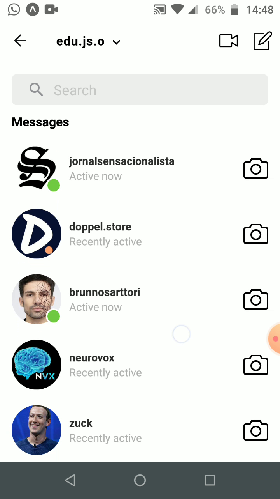
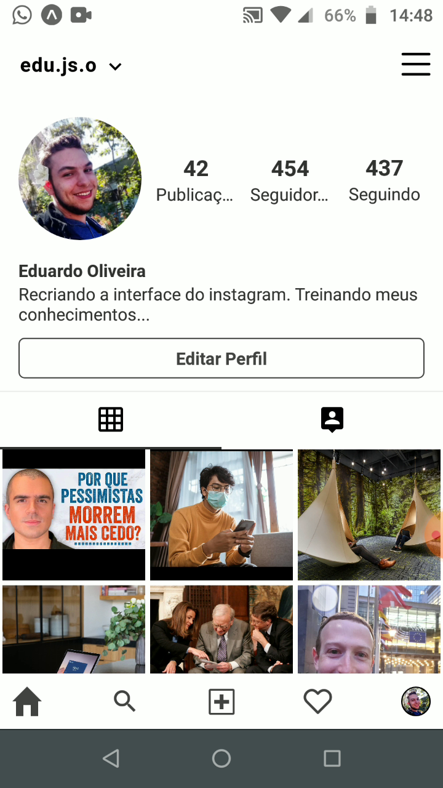

# Instagram Clone

<h2 align="center">
    <div style="display:flex">
        
        
    </div>
    <div style="display:flex">
    
    
    </div>
</h2>
<h2 align="center">
    <a href="https://youtu.be/Vwug-k8TgE8">Video no YouTube</a>
</h2>

## :bulb: Ideia

O projeto foi começado acompanhando um dos videos da Rocketseat e, após a conclusão do feed, apresentado no vídeo, resolvi tentar desenvolver algo mais que não estava presente no projeto.

## :gear: Tecnologias

- React-native
- Expo

## :hammer: Ferramentas

- [Visual Studio Code](https://code.visualstudio.com/download)
- [Expo Mobile Client](https://expo.io)
- [GIMP](https://www.gimp.org/)

**Observação:** o GIMP foi utilizado para a manipulação das imagens utilizadas no projeto.

## :bookmark_tabs: Algumas Limitações

- Ícones ligeiramente diferentes dos originais.

- Poucos componentes animados, visto que ainda estou iniciando nos estudos do react-native.

- A funcionalidade da página do perfil em expandir ou omitir o bloco contendo as informações do perfil para exibir as fotos na tela toda possui alguns bugs e não é tão performático, porém como ainda estou iniciando os estudos do react-native, permiti que ficasse dessa forma. Espero poder, no decorrer do tempo, melhorar isso.

- A url de localhost (ver a parte Executando o Projeto) deveria ser alterado para algo geral (variável de ambiente?).

## :book: Coisas Aprendidas

Algumas das coisas aprendidas com esse projeto são:

- Uso do react-native.

- O component LazyImage, juntamente com o viewableItems do FlatList, para criar a funcionalidade de carregar as imagens quando necessário.

- O uso do pacote `json-server` para o desenvolvimento.

## :computer: Executando o projeto

### 1 - Clone o repositório:

```bash
git clone https://github.com/EduardoJM/rn-expo-instagram-clone.git
```

### 2 - Instalando as dependências

```bash
cd rn-expo-instagram-clone
yarn
```

### 3 - Alterando o ip do servidor local

Altere, no arquivo `package.json`, o ip local `10.0.0.102` para o seu ip local no script `start-dev-server`

```json
"start-dev-server": "yarn json-server server.json -d 1000 -w -H 10.0.0.102 -p 3000"
```

Altere o mesmo ip `10.0.0.102` para o novo ip selecionado, nos arquivos:

```
src/pages/Direct/index.js
src/pages/Feed/index.js
src/components/ProfileGallery/index.js
```

### 4 - Execute o servidor

```bash
yarn start-dev-server
```

### 5 - Execute o app

```
yarn start
```

Aguarde o projeto incializar, escaneie o QRCode que irá aparecer no terminal com o app Expo disponível na PlayStore e aguarde a compilação do JavaScript e o Download para o aparelho. Pronto, o app já está sendo executado.

## :nerd_face: Autor

### Eduardo Oliveira

- GitHub: [@EduardoJM](https://github.com/eduardojm/)
- LinkedIn: [/in/edujso](https://www.linkedin.com/in/edujso/)
- Instagram: [@edu.js.o](https://www.instagram.com/edu.js.o/)
